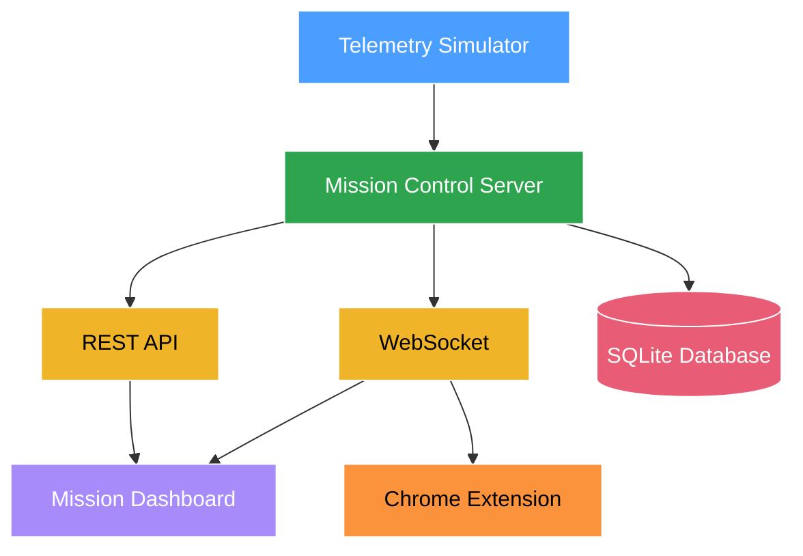
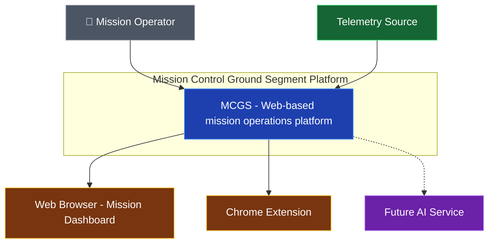
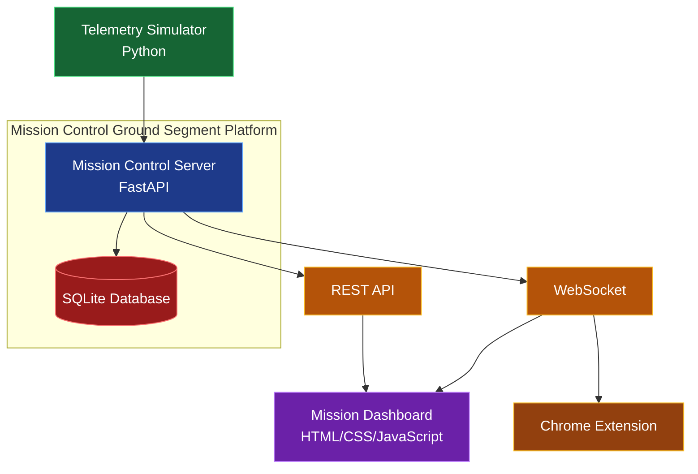

# 🚀 Mission Control Ground Segment Platform (MCGS)

> **An open, modular mission operations platform for CubeSats, educational satellites, and research missions.**


[](https://opensource.org/licenses/MIT)
[](https://github.com/your-username/mission-control-ground-segment-platform)
[](https://devclash.com)

---

## 📋 Overview

**Mission Control Ground Segment Platform (MCGS)** is a lightweight, web-based mission operations platform that simulates the core functions of a professional satellite ground segment. It provides real-time telemetry monitoring, command capabilities, visualization tools, and AI-assisted insights — all in a single, cohesive application.

Built during **Dev Clash: Code Build Conquer** (6.5-hour hackathon), MCGS serves as both a polished demo and a **foundational codebase** for the Space Dogs long-term mission operations ecosystem. Rather than a narrow telemetry receiver, it is designed as a complete, extensible **Mission Control Center (MCC)** software platform.

### Why MCGS?
- **Hackathon-optimized**: Focuses on high-impact, demonstrable features deliverable in limited time.
- **Future-proof**: Clean architecture that supports real hardware integration (SDRs, antennas, flight software) later.
- **Educational & Research-friendly**: Ideal for universities, student teams, and smallsat developers.
- **Differentiator**: Combines modern web technologies, real-time updates (WebSockets), interactive visualizations, and AI assistance.

---

## ✨ Key Features

### Current (Hackathon MVP)
- **Live Telemetry Simulator** — Realistic CubeSat data generation (battery, temperature, signal strength, subsystem health, etc.).
- **Mission Control Dashboard** — Unified operator interface with status cards, navigation, and responsive design.
- **Interactive Visualizations**:
  - Real-time charts (Chart.js) for battery, temperature, signal, CPU, power.
  - Leaflet.js map showing simulated satellite position and ground station visibility.
- **REST + WebSocket APIs** — Clean endpoints + live broadcasting.
- **SQLite Persistence** — Stores historical telemetry.
- **Chrome Companion Extension** — Quick-glance popup with key metrics and alerts.
- **Modular Backend** — FastAPI with organized routers, services, models, and schemas.

### Planned / Roadmap
- AI Anomaly Detection & Explanation
- Command uplink simulation & history
- Satellite pass prediction
- Mission timeline & event logging
- Multi-satellite support
- User authentication + RBAC
- Automated mission reports & analytics
- Future hardware integrations (SDR, ground station radios, HITL)

---

## 🏗️ Architecture



### C4 Level 1 - System Context Diagram



### C4 Level 2 - Container Diagram


Core Principles:

Separation of Concerns: Simulator, services, API layer, and UI are cleanly decoupled.
Real-time First: WebSockets for live feel.
Extensibility: Services layer makes adding new subsystems or hardware straightforward.
Lightweight: No heavy frontend frameworks for hackathon velocity.

Full details → docs/Architecture.md

🛠️ Technology Stack
Backend

Python 3.11+
FastAPI (async, auto OpenAPI/Swagger)
Uvicorn
SQLite (PostgreSQL-ready)
Pydantic v2 for validation

Frontend

Vanilla HTML5 + CSS3 + ES2022 JavaScript
Chart.js
Leaflet.js
Font Awesome

Browser Extension

Manifest V3
Popup + background/service worker

DevOps / Tools

Git + GitHub (Milestones, Issues, Labels, Actions)
VS Code

```
📁 Repository Structure
mission-control-ground-segment-platform/
├── docs/                    # Architecture, API, decisions, roadmap
├── images/
│   ├── banner/
│   ├── icons/
│   ├── screenshots/
│   └── diagrams/
├── frontend/                # Static HTML/CSS/JS
│   ├── css/
│   ├── js/
│   └── components/
├── backend/
│   ├── app/
│   │   ├── core/            # config, logging, constants
│   │   ├── database/
│   │   ├── models/
│   │   ├── routers/
│   │   ├── schemas/
│   │   ├── services/
│   │   ├── websocket/
│   │   └── main.py
│   ├── simulator/           # telemetry_generator.py
│   └── tests/
├── chrome-extension/
│   ├── manifest.json
│   ├── popup.html
│   ├── popup.js
│   ├── background.js
│   └── icons/
├── examples/                # Sample telemetry & command payloads
├── .github/                 # Workflows, issue templates
├── requirements.txt
├── README.md
├── LICENSE
└── CONTRIBUTING.md
```

🚀 Getting Started
1. Clone & Setup
```
git clone https://github.com/your-username/mission-control-ground-segment-platform.git
cd mission-control-ground-segment-platform
```
2. Backend
```
# Create virtual environment
python -m venv .venv

# Activate
# Windows:
.venv\Scripts\activate
# Linux / macOS:
source .venv/bin/activate

# Install dependencies

pip install -r requirements.txt

# Run server
uvicorn backend.app.main:app --reload --port 8000
```
Open Swagger docs at: http://localhost:8000/docs
3. Frontend
Open frontend/index.html directly or serve with:
```
cd frontend && python -m http.server 3000
```
4. Chrome Extension

Open chrome://extensions/
Enable Developer Mode
Load unpacked → select chrome-extension/ folder


📍 Project Status & Roadmap
Current Phase: Hackathon MVP (Post-Dev Clash polish)
Phased Roadmap (see docs/Roadmap.md for details):

Phase 1: Setup + Simulator + Core API
Phase 2: Dashboard + Visualizations
Phase 3: Chrome Extension + Real-time
Phase 4: AI Intelligence
Phase 5: Hardware Integration & Production Readiness


🎯 Development Workflow
This project uses structured GitHub practices:

Milestones for major phases
Priority + Type Labels (high/medium/low + backend/frontend/etc.)
Feature branches (feature/telemetry, feature/dashboard, etc.)
Clear Acceptance Criteria in issues

See docs/Development.md (or create it).

🤝 Contributing
Contributions are welcome — especially from students, space enthusiasts, and developers interested in space software.
Please read CONTRIBUTING.md first.

📄 License
This project is licensed under the MIT License — see LICENSE file.

🌌 About Space Dogs
Space Dogs is a private aerospace research organization dedicated to:

Experimental Rocketry
CubeSat development
Ground station infrastructure
Mission automation & AI for space
Open-source space software

MCGS is one building block in a broader ecosystem supporting real and educational satellite missions.

🙏 Acknowledgements

Built with excellent open-source tools: FastAPI, Chart.js, Leaflet, SQLite, GitHub
Inspired by professional systems (NASA, ESA, industry MCC software)
Special thanks to the Dev Clash organizers and the developer communities


📸 Screenshots & Demo
(Add screenshots here after hackathon)

Dashboard Overview
Live Telemetry Charts
Ground Station Map
Chrome Extension Popup

Demo Video (to be recorded)

Project Status: 🚧 Active Development
Started during Dev Clash: Code Build Conquer (July 2026) and continuing as a Space Dogs flagship software project.

Made with ❤️ for the space community.
